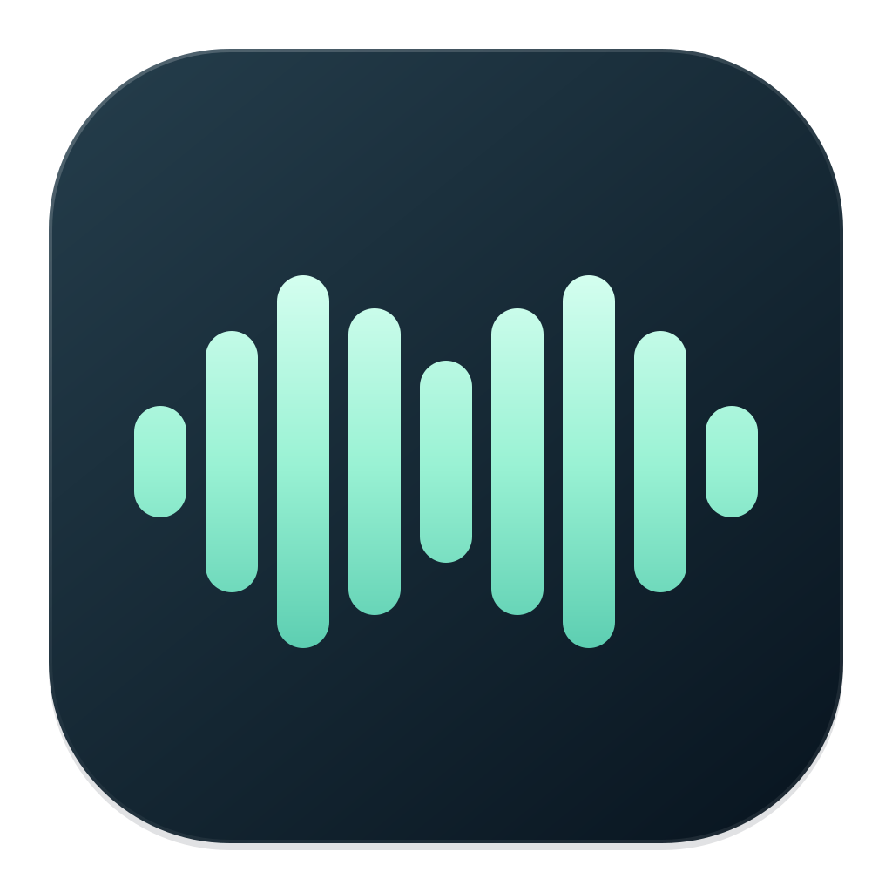

<p align="center">
  
</p>

<h1 align="center">LocalFlow</h1>

<p align="center">
  <a href="https://github.com/ajbarryiii/LocalFlow/releases"><b>⬇ LocalFlow DMG downloads</b></a><br>
  <sub>Apple Silicon · macOS 26 or later</sub><br>
  <sub>No packaged release is available yet. <a href="#build-locally">Build locally</a> to try LocalFlow today.</sub>
</p>

---

A native macOS menu-bar dictation app using the bundled **LocalFlow**
English speech model, derived from NVIDIA Parakeet v2. This fork runs speech recognition on the Mac, with no
API key, provider account, network transcription, LLM cleanup, translation,
Edit Mode, or screenshot/app context capture.

Requires an **Apple Silicon Mac running macOS 26 or later**. Other devices
are not supported by this model bundle yet. The app and model are about
359 MB together; runtime memory use can exceed the model's disk size.

## Dictation

1. Open the bundled app and complete local setup.
2. Grant Microphone and Accessibility access. On macOS 27, the Accessibility
   permission pane is named **Device Control and Data Access** under
   System Settings → Privacy & Security. Screen Recording is not needed.
3. Choose Hold to Talk, Tap to Toggle, and optional Paste Again shortcuts.
4. Dictate into any text field. LocalFlow transcribes locally and pastes at
   the cursor, optionally restoring the previous clipboard.

The model prepares in the background at startup and stays in memory for the
session. First device preparation can take several minutes; Settings and the
menu show its state. Settings provides a retry if preparation fails.
Recordings longer than 15 seconds use independent chunks and can lose context
at boundaries. There is no cloud fallback.

Voice macros match complete phrases locally and paste predefined text. An
optional trailing “press enter” command submits after pasting. Neither feature
uses an LLM. Dictated instructions otherwise remain literal text.

The latest 20 recordings and transcripts are retained locally for playback
and local retry. Clear or delete them from Run Log. Existing history and
shortcut preferences remain compatible; old provider preferences and
credentials are ignored and are not read or automatically erased.

## Build locally

LocalFlow uses `swiftc` and Make, without Swift Package Manager or an Xcode
project. Install Xcode and its command-line tools. Model weights are kept
outside Git; obtain or prepare the pinned model bundle as described in
[the integration notes](Resources/Parakeet/INTEGRATION.md).

```sh
SDKROOT="$(xcrun --sdk macosx --show-sdk-path)" make check
git diff --check
SDKROOT="$(xcrun --sdk macosx --show-sdk-path)" make \
  ARCH="$(uname -m)" CODESIGN_IDENTITY=- PARAKEET_BUNDLE_DIR="MODEL_BUNDLE"
open "build/LocalFlow Dev.app"
```

The ad hoc development build may need its existing system approval refreshed
when its executable changes. The app's permission guidance can reveal the
exact running bundle in Finder for this repair.

The existing FreeFlow bundle identifiers and Application Support directories
are retained for preferences, history, audio, and recording-state compatibility.
The LocalFlow name does not require moving or duplicating existing user data.

The software updater checks [this fork](https://github.com/ajbarryiii/LocalFlow)
and may contact GitHub when
checking or downloading app updates. Audio and transcripts are not sent by
the updater. Turn off automatic update checks in Settings if desired.

## Credits and licensing

LocalFlow is based on [FreeFlow](https://github.com/zachlatta/freeflow) by
Zach Latta and contributors. The original copyright and MIT license are
preserved, with attribution included in Settings and every built app bundle.
Application code retains the [MIT license](LICENSE). Model and adapted
inference-code licenses and attribution are included in
[Resources/Parakeet](Resources/Parakeet).
